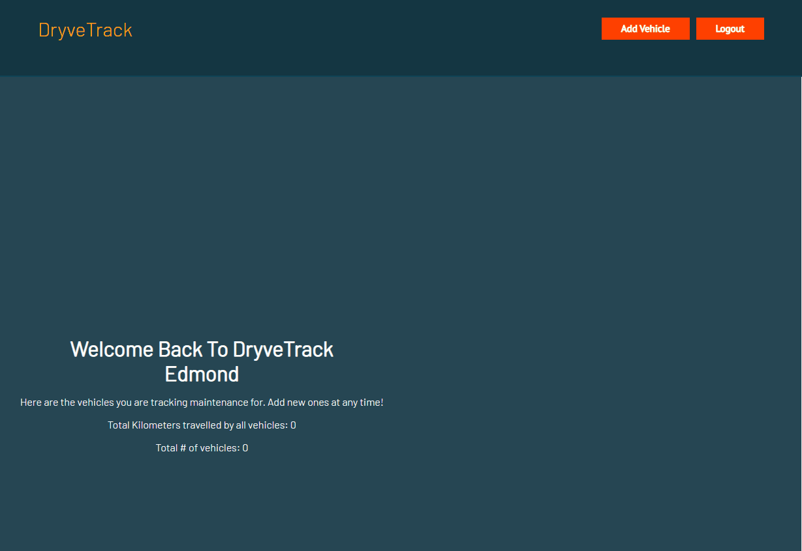
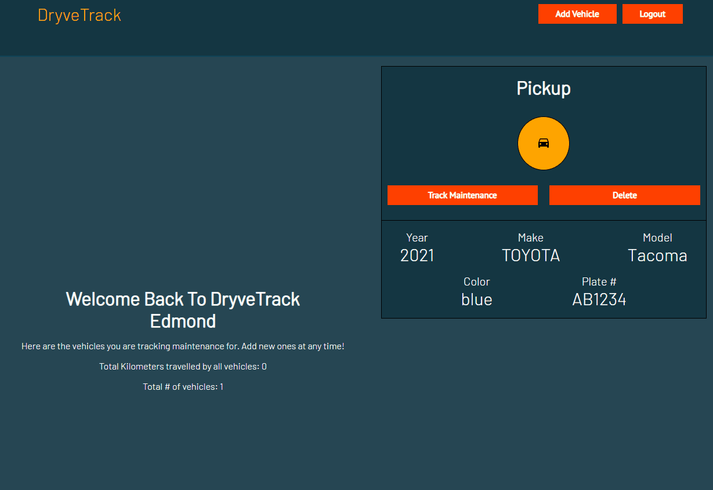

# [~~View The Live Site For DryveTrack!~~]() 
## Edit: DryveTrack is no longer hosted on Heroku since they removed their free tier! The application will have to be run locally. Once I learn how to setup a CI/CD pipeline, I'll host it on another platform. Test Test

***


***

## Brief Description
Welcome to DryveTrack, an easy to use web application to track vehicle maintenance! This project builds off of [FleetCare](https://github.com/echen12/FleetCare) which was the first version of this application. Improvements that have been made since [FleetCare](https://github.com/echen12/FleetCare) include user authentication, and a fully redesigned and responsive UI.

Edit v1: More improvements have been made to DryveTrack! When I first made this application back in 2021, I created the backend with Node.js because that was what I was familiar with at the time. After a year of learning more technologies, I recently re-wrote the backend using ASP.Net 6 using a Model View Service (MVS) architecture which you can view [here](https://github.com/echen12/DryveTrack_BackEnd). At this time, I removed the Mileage Tracker component as I'm in the process of improving how oil change intervals are calculated. Otherwise, this application is fully functional.


***
## User Story
**Business owners and logistic companies need a way of tracking their vehicles to prolong their investments. This application tracks vehicles, mileage, warranty information and oil life to mantain vehicular upkeep.**
***

## Table of Contents
1. [Technology Used](#technology-used)
2. [Installations](#installations)
3. [Feature Code](#feature-code)
4. [Future Implementations](#future-implementations)
***

## How to Run
1) Ensure you have Visual Studio, Microsoft SQL Server Management Studio and a SQL server running. Then, clone the backend [here](https://github.com/echen12/DryveTrack_BackEnd) and follow the instructions there to run the solution.
2) Clone this project and run ``` npm ``` to install the required dependencies. ``` npm start ``` starts the front end.
***

## Technologies Used
* MongoDB
* Express
* React
* Node
* [NHTSA Vehicle API](https://vpic.nhtsa.dot.gov/api/)
* Styled Components
* Heroku
* MongoDB Atlas
* React Router
* JWT
* Bcrypt.js
***

## Installations
```
npm axios
npm date-fns
npm moment
npm react-dom
npm react-router-dom
npm express
npm cors
npm dotenv
npm mongoose
npm nodemon
npm jsonwebtoken
npm bcrypt
```
***
## Feature Code


* Begin by creating an account with DryveTrack. Upon successfully registering, [Bcrypt](https://www.npmjs.com/package/bcrypt) is used to encrypt the password and RESTful API commands are used to validate the new user's registration information. Then, a [JWT](https://jwt.io/) is given to the user so they can access protected routes.



* Inputting the vehicle identification number (VIN) sends a GET request to the [NHTSA API](https://vpic.nhtsa.dot.gov/api/)  and the vehicle make, model and year are decoded from it. Every vehicle has a unique VIN so this makes identifying any vehicle easy. User confirmation ensures that the vehicle information is correct before submission.


* After user confirmation, RESTful API commands pulls all the vehicle information from MongoDB and JS map functions create individual vehicle information cards. From here, the user can either delete or track the information of each vehicle.


* When the user updates the mileage, the date of the update is automatically determined and stored to MongoDB. The history mileage is also called from MongoDB to allow the user to view the mileage progression.

* When the user adds an oil change record, the oil life gets initialized to 100% and every mileage update calculates the oil life based on the oil change interval. After the current mileage exceeds the interval, the user is recommended to change the oil. This also updates the mileage tracker.

***

## Future Implementations

* Mapbox location tracking
* Dark/Light Mode
